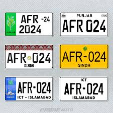
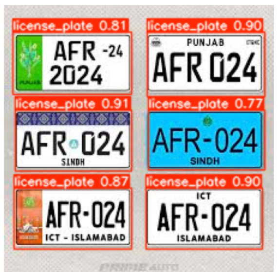

# 🚗 License Plate Detection & OCR

Automatic license plate detection and text recognition using YOLOv8 and EasyOCR.

| Input | Output |
|-------|--------|
|  |  |

## What It Does

- Detects license plates in images using a custom-trained YOLOv8 model
- Extracts and reads the plate text using EasyOCR
- Preprocesses the plate (resize, grayscale, threshold) for better OCR accuracy

## Tech Stack

| Tool | Purpose |
|------|---------|
| YOLOv8 (Ultralytics) | License plate detection |
| EasyOCR | Text recognition |
| OpenCV | Image preprocessing |
| Python | Core language |

## Installation

```bash
# 1. Clone the repo
git clone https://github.com/KhawarAli09/license-plate-detection.git
cd license-plate-detection

# 2. Install dependencies
pip install -r requirements.txt

# 3. Download model weights
# See weights/README.md for download link
# Place best.pt inside the weights/ folder
```

## Usage

```bash
python detect.py --image sample_img/download.jpg --weights weights/best.pt
```

## Project Structure
license-plate-detection/

├── detect.py              # Main detection script

├── notebook.ipynb         # Colab notebook

├── requirements.txt       # Dependencies

├── weights/               # Place best.pt here

│   └── README.md

└── sample_img/            # Test images

├── download.jpg

└── result.png

## Author

**Khawar Ali** — CS Student @CASE Islamabad
AI/ML Intern @ZATNav Pvt. Ltd.
[GitHub](https://github.com/KhawarAli09)
